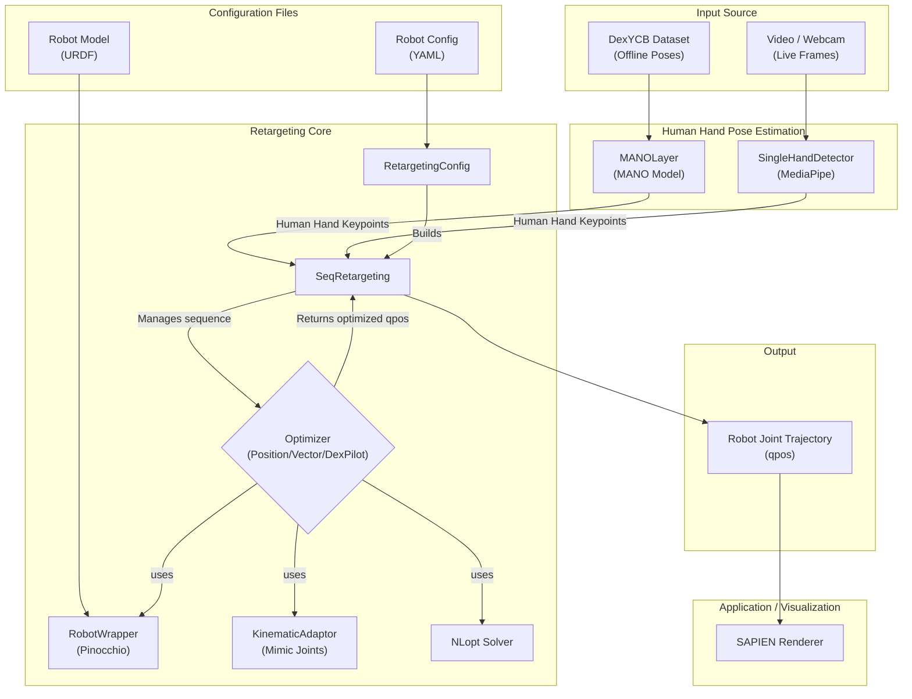
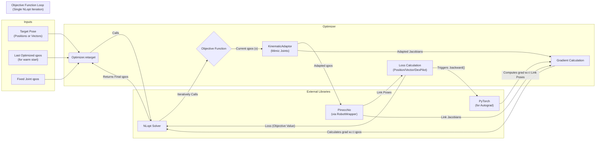

# System Diagram

This diagram illustrates the theory of operation for the dex-retargeting library.

## Theory of Operation

The `dex-retargeting` library is designed to map human hand motions onto a variety of robotic hands. This process is known as retargeting. The system can be broken down into the following stages:

1.  **Input Acquisition**: The system accepts two primary forms of input:
    *   **Offline Datasets**: Pre-recorded hand-object interaction data, such as the [DexYCB dataset](https://dex-ycb.github.io/). These datasets provide accurate, time-stamped hand and object poses.
    *   **Live Video**: A video stream from a file or a webcam, capturing real-time human hand movements.

2.  **Human Pose Estimation**:
    *   For offline datasets (e.g., DexYCB), the system uses the provided MANO hand model parameters. The `MANOLayer` (a wrapper around `manopth`) computes the 3D vertices and joint locations of the human hand for each frame.
    *   For live video, the `SingleHandDetector` utilizes the [MediaPipe Hands](https://google.github.io/mediapipe/solutions/hands) solution to detect 21 3D keypoints of the human hand in real-time.

3.  **Core Retargeting**: This is the central part of the library, where the estimated human hand pose is translated into robot joint angles.
    *   **Configuration (`RetargetingConfig`)**: The process begins by loading a YAML configuration file specific to the target robot hand, the desired retargeting method, and the hand's chirality (left/right). This file defines crucial parameters, including the robot's URDF file, which links/joints to target, and optimization settings.
    *   **Robot Model (`RobotWrapper`)**: The robot's kinematic model is loaded from a URDF file using `pinocchio`. The `RobotWrapper` provides an interface for forward kinematics and Jacobian calculations, which are essential for the optimization process.
    *   **Sequence Management (`SeqRetargeting`)**: This class orchestrates the retargeting for a sequence of input frames. It initializes the optimizer and manages the state between frames, such as the last computed joint positions, which are used as a warm start for the next frame to ensure temporal smoothness.
    *   **Optimization (`Optimizer`)**: The core of the retargeting is a non-linear optimization problem, solved by `nlopt`. The goal is to find the robot joint angles (`qpos`) that best match the human hand's pose. The library provides three optimization strategies:
        *   `PositionOptimizer`: Minimizes the Euclidean distance between the 3D positions of specified keypoints on the human hand and corresponding links on the robot hand. This is typically used for offline retargeting where precise position matching is important.
        *   `VectorOptimizer`: Matches the direction and magnitude of vectors formed between pairs of human hand keypoints (e.g., from the palm to each fingertip) to corresponding vectors on the robot hand. This is well-suited for real-time teleoperation.
        *   `DexPilotOptimizer`: An extension of the vector-based approach inspired by the DexPilot paper. It adds a "closing grasp" prior by projecting finger distances, leading to more stable grasping motions.
    *   **Kinematic Adaptations (`KinematicAdaptor`)**: This component handles specific kinematic constraints of the robot, most notably `mimic joints` (where one joint's motion is a function of another). It adapts the forward kinematics and Jacobians so the optimizer can work with a reduced set of independent joints while respecting the robot's full kinematic model.

4.  **Output**: The result of the retargeting process is a time-series of joint positions (`qpos`) for the target robotic hand.

5.  **Application & Visualization**: The generated joint trajectory can be used to control a physical robot or, as shown in the examples, to animate a simulated robot hand in the [SAPIEN](https://sapien.ucsd.edu/) physics simulator for visualization and analysis.

---

## Optimizer Internals

This diagram details the internal workflow of the `Optimizer` classes.

