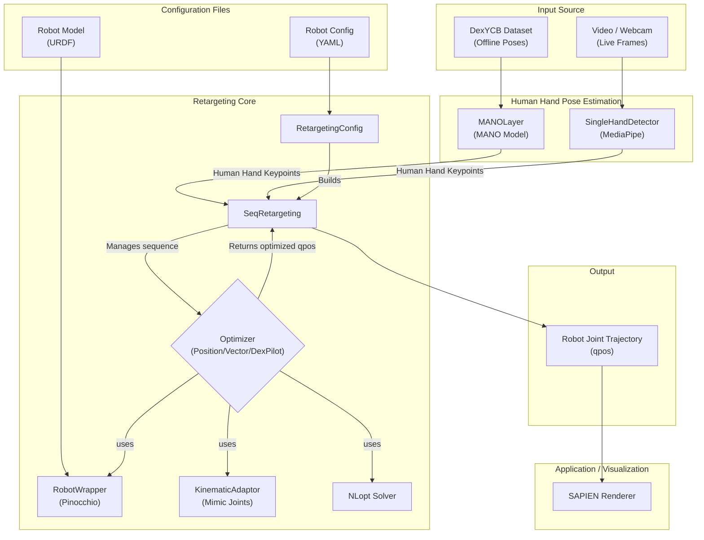
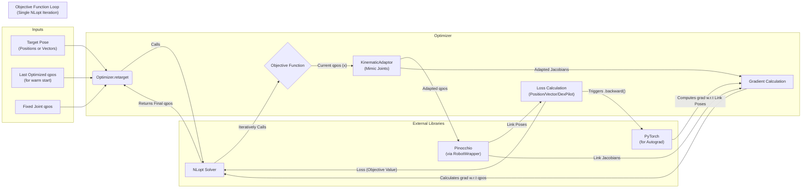

# System Diagram

This diagram illustrates the theory of operation for the dex-retargeting library.



## Theory of Operation

The `dex-retargeting` library is designed to map human hand motions onto a variety of robotic hands. This process is known as retargeting. The system can be broken down into the following stages:

1.  **Input Acquisition**: The system accepts two primary forms of input:
    *   **Offline Datasets**: Pre-recorded hand-object interaction data, such as the [DexYCB dataset](https://dex-ycb.github.io/). These datasets provide accurate, time-stamped hand and object poses.
    *   **Live Video**: A video stream from a file or a webcam, capturing real-time human hand movements.

2.  **Human Pose Estimation**:
    *   For offline datasets (e.g., DexYCB), the system uses the provided MANO hand model parameters. The `MANOLayer` (a wrapper around `manopth`) computes the 3D vertices and joint locations of the human hand for each frame.
    *   For live video, the `SingleHandDetector` utilizes the [MediaPipe Hands](https://google.github.io/mediapipe/solutions/hands) solution to detect 21 3D keypoints of the human hand in real-time.

3.  **Core Retargeting**: This is the central part of the library, where the estimated human hand pose is translated into robot joint angles.
    *   **Configuration (`RetargetingConfig`)**: The process begins by loading a YAML configuration file specific to the target robot hand, the desired retargeting method, and the hand's chirality (left/right). This file defines crucial parameters, including the robot's URDF file, which links/joints to target, and optimization settings.
    *   **Robot Model (`RobotWrapper`)**: The robot's kinematic model is loaded from a URDF file using `pinocchio`. The `RobotWrapper` provides an interface for forward kinematics and Jacobian calculations, which are essential for the optimization process.
    *   **Sequence Management (`SeqRetargeting`)**: This class orchestrates the retargeting for a sequence of input frames. It initializes the optimizer and manages the state between frames, such as the last computed joint positions, which are used as a warm start for the next frame to ensure temporal smoothness.
    *   **Optimization (`Optimizer`)**: The core of the retargeting is a non-linear optimization problem, solved by `nlopt`. The goal is to find the robot joint angles (`qpos`) that best match the human hand's pose. The library provides three optimization strategies:
        *   `PositionOptimizer`: Minimizes the Euclidean distance between the 3D positions of specified keypoints on the human hand and corresponding links on the robot hand. This is typically used for offline retargeting where precise position matching is important.
        *   `VectorOptimizer`: Matches the direction and magnitude of vectors formed between pairs of human hand keypoints (e.g., from the palm to each fingertip) to corresponding vectors on the robot hand. This is well-suited for real-time teleoperation.
        *   `DexPilotOptimizer`: An extension of the vector-based approach inspired by the DexPilot paper. It adds a "closing grasp" prior by projecting finger distances, leading to more stable grasping motions.
    *   **Kinematic Adaptations (`KinematicAdaptor`)**: This component handles specific kinematic constraints of the robot, most notably `mimic joints` (where one joint's motion is a function of another). It adapts the forward kinematics and Jacobians so the optimizer can work with a reduced set of independent joints while respecting the robot's full kinematic model.

4.  **Output**: The result of the retargeting process is a time-series of joint positions (`qpos`) for the target robotic hand.

5.  **Application & Visualization**: The generated joint trajectory can be used to control a physical robot or, as shown in the examples, to animate a simulated robot hand in the [SAPIEN](https://sapien.ucsd.edu/) physics simulator for visualization and analysis.

---

## Optimizer Internals

This diagram details the internal workflow of the `Optimizer` classes.



---

> @src/ Could you explain the difference between position retargeting and vector retargeting?

Position Retargeting

  * Goal: To match the absolute 3D world positions of specific points (links) on the robot hand with the corresponding 3D positions from the source (e.g., a human hand).
  * Mechanism: The PositionOptimizer takes a set of target 3D coordinates as input. It then adjusts the robot's joint angles to move the specified links on the robot hand as close as possible to these target coordinates. The optimization minimizes the direct positional error between the robot links and the target
    points.
  * Configuration: In the YAML files (type: position), this method requires target_link_names—a list of single links on the robot (like thumb_tip, index_tip) whose absolute positions will be matched.
  * Use Case: As noted in src/dex_retargeting/constants.py, this is primarily for "offline data processing, especially hand-object interaction data." It is suitable when you have precise 3D positional data for a hand and want to replicate that exact pose in world space.

---

Vector Retargeting

  * Goal: To match the relative vectors between pairs of points on the robot hand with the corresponding vectors on the source hand. This focuses on replicating the hand's posture and the relative arrangement of its parts, rather than its absolute position in space.
  * Mechanism: The VectorOptimizer defines vectors on the robot hand, typically from a common origin (like the palm) to various fingertips. It then adjusts the robot's joint angles to make these internal vectors on the robot match the direction and magnitude of the corresponding vectors from the source.
  * Configuration: In the YAML files (type: vector), this method requires target_origin_link_names and target_task_link_names. These two lists define the start and end points of the vectors to be matched (e.g., from base_link to thumb_tip).
  * Use Case: As noted in src/dex_retargeting/constants.py, this is designed for "teleoperation." Because it focuses on relative vectors, it is more robust to variations or errors in the tracking of the hand's overall position and is better suited for controlling a robot hand in real-time from a live video feed or
    VR controller.

---

> Could you give me a crash course on what it would take to implement a minimal example of dex-retargeting, on a custom hand pose input and simulator (mujoco)?

✦ Of course. Here is a crash course on what it would take to implement a minimal example of dex-retargeting with your own hand pose data and a MuJoCo simulator.

  The core idea is that dex-retargeting acts as a sophisticated calculator. You provide it with:
   1. A URDF model of your robot hand.
   2. A configuration file explaining how to retarget (e.g., match finger positions or vectors).
   3. Your real-time hand data (the target).

  It then returns the robot's joint angles (qpos) that best match your target. You then take these joint angles and apply them to your MuJoCo simulation.

  Here are the essential steps:

  Step 1: Get a URDF for Your Robot Hand

  dex-retargeting is built entirely around URDF files. You must have a URDF that defines your robot hand's kinematics (links, joints, etc.).

   * Requirement: A valid URDF file for your custom hand.
   * Crucial Detail: Pay close attention to the <link> and <joint> names within this file. You will need them for the configuration in the next step.

  Let's assume you have my_hand.urdf.

  Step 2: Create a Retargeting Configuration YAML

  This file tells the optimizer how to map the human hand to the robot hand. For a minimal example, Vector Retargeting is often the most intuitive choice for real-time control. It works by matching the vectors from the palm to the fingertips.

  Create a file named my_hand_retargeting.yml:

```
    1 # my_hand_retargeting.yml
    2 retargeting:
    3   # Use 'vector' for teleoperation. 'position' is better for offline pose matching.
    4   type: vector
    5   urdf_path: /path/to/your/my_hand.urdf
    6 
    7   # The joints on your robot you want the optimizer to control.
    8   # If null, it will try to control all non-fixed joints.
    9   target_joint_names: ['joint1', 'joint2', 'thumb_joint', 'index_joint', ...]
   10 
   11   # --- Vector Retargeting Specifics ---
   12   # Define the vectors to match. Typically from the palm/wrist to each fingertip.
   13   # These are LINK names from your URDF.
   14   target_origin_link_names: [ "palm_link", "palm_link", "palm_link", "palm_link", "palm_link" ]
   15   target_task_link_names: [ "thumb_tip_link",  "index_tip_link", "middle_tip_link", "ring_tip_link", "pinky_tip_link" ]
   16 
   17   # This is the most critical part: mapping your input data to the robot vectors.
   18   # It tells the optimizer: "To drive the robot's palm->thumb vector,
   19   # use the vector created by points 0 and 4 from my input data."
   20   # The shape is (2, num_vectors). First row is origin points, second is task points.
   21   target_link_human_indices: [ [ 0, 0, 0, 0, 0 ], [ 4, 8, 12, 16, 20 ] ]
   22 
   23   # Scaling factor to account for size differences between human and robot hand
   24   scaling_factor: 1.0
   25 
   26   # Filtering to smooth the output motion. 1.0 = no filter.
   27   low_pass_alpha: 0.2
```

  Step 3: Prepare Your Custom Hand Pose Input

  The retargeting optimizer expects a simple NumPy array as the reference value. Your job is to take your custom hand pose data (e.g., from MediaPipe, a VR tracker, etc.) and format it correctly.

  For Vector Retargeting, the input ref_value is a NumPy array of shape (num_vectors, 3) representing the target vectors.

  Let's assume your custom input my_hand_data is a NumPy array of shape (21, 3), representing 21 keypoints of a human hand in 3D space (a common format).

```
    1 import numpy as np
    2 
    3 # Assume this is your input data: 21 keypoints, each with (x, y, z)
    4 # For example, from MediaPipe: 0=wrist, 1-4=thumb, 5-8=index, etc.
    5 my_hand_data = np.random.rand(21, 3)
    6 
    7 # Now, construct the `ref_value` based on the `target_link_human_indices`
    8 # from your YAML file.
    9 # Indices: [[0, 0, 0, 0, 0], [4, 8, 12, 16, 20]]
   10 human_origin_indices = [0, 0, 0, 0, 0]  # All vectors start from the wrist (point 0)
   11 human_task_indices = [4, 8, 12, 16, 20] # Tip of thumb, index, middle, ring, pinky
   12 
   13 # Extract the 3D points from your data
   14 origin_points = my_hand_data[human_origin_indices] # Shape: (5, 3)
   15 task_points = my_hand_data[human_task_indices]     # Shape: (5, 3)
   16 
   17 # Calculate the target vectors
   18 target_vectors = task_points - origin_points # Shape: (5, 3)
   19 
   20 # This `target_vectors` is the `ref_value` you will pass to the retargeting function.
```

  Step 4: The Core Retargeting Loop

  Now you can write the main Python script to run the retargeting.

```
    1 from dex_retargeting.retargeting_config import RetargetingConfig
    2 
    3 # 1. Load the configuration file you created
    4 # Make sure to set the default URDF directory if you used relative paths
    5 RetargetingConfig.set_default_urdf_dir("/path/to/your/urdf/folder/")
    6 config = RetargetingConfig.load_from_file("my_hand_retargeting.yml")
    7 
    8 # 2. Build the retargeting object. This creates the optimizer inside.
    9 retargeting = config.build()
   10 
   11 # 3. (Inside your main loop) Retarget
   12 # `target_vectors` is the NumPy array from Step 3
   13 robot_qpos = retargeting.retarget(ref_value=target_vectors)
   14 
   15 # `robot_qpos` is now a NumPy array containing the calculated joint angles
   16 # for your robot hand.
   17 print("Target joint angles:", robot_qpos)
   18 print("Joint names:", retargeting.joint_names)
```

  Step 5: Integration with MuJoCo

  This is the final piece. You take the robot_qpos from dex-retargeting and apply it to your MuJoCo simulation.

  The most important part is ensuring the joint order matches. The retargeting.joint_names property gives you the exact order of the joints in the output robot_qpos array. You must map this to the joint order in your MuJoCo model.

  Here is a minimal pseudo-code for your MuJoCo loop:

```
    1 # import mujoco
    2 # import mujoco.viewer
    3 
    4 # ... (load your MuJoCo model) ...
    5 # model = mujoco.MjModel.from_xml_path('your_mujoco_model.xml')
    6 # data = mujoco.MjData(model)
    7 # viewer = mujoco.viewer.launch_passive(model, data)
    8 
    9 # Get the mapping from dex-retargeting joint names to your MuJoCo joint indices
   10 # This is a critical one-time setup step!
   11 dex_joint_names = retargeting.joint_names
   12 mujoco_joint_ids = [mujoco.mj_name2id(model, mujoco.mjtObj.mjOBJ_JOINT, name) for name in dex_joint_names]
   13 
   14 
   15 # --- In your simulation loop ---
   16 # while viewer.is_running():
   17     # 1. Get your custom hand data and compute `target_vectors` (from Step 3)
   18     # my_hand_data = get_my_latest_hand_data()
   19     # target_vectors = ...
   20 
   21     # 2. Run retargeting (from Step 4)
   22     # robot_qpos = retargeting.retarget(target_vectors)
   23 
   24     # 3. Apply the joint angles to MuJoCo
   25     # Make sure to use the correct indices you found earlier
   26     # This directly sets the joint positions (kinematic control)
   27     # data.qpos[mujoco_joint_ids] = robot_qpos
   28 
   29     # For more physical control, you would set the control targets
   30     # data.ctrl[mujoco_actuator_ids] = robot_qpos
   31 
   32     # 4. Step the simulation
   33     # mujoco.mj_step(model, data)
   34     # viewer.sync()
```

  Summary Workflow

   1. Model (URDF): Define your robot's structure.
   2. Configure (YAML): Define how to map human motion to the robot's structure.
   3. Format Input (NumPy): Get your hand data into a simple array of vectors.
   4. Retarget (Python): Call retargeting.retarget() to get the desired robot joint angles.
   5. Apply to Simulator (MuJoCo): Use the output joint angles to drive your simulation, ensuring the joint order is correct.
